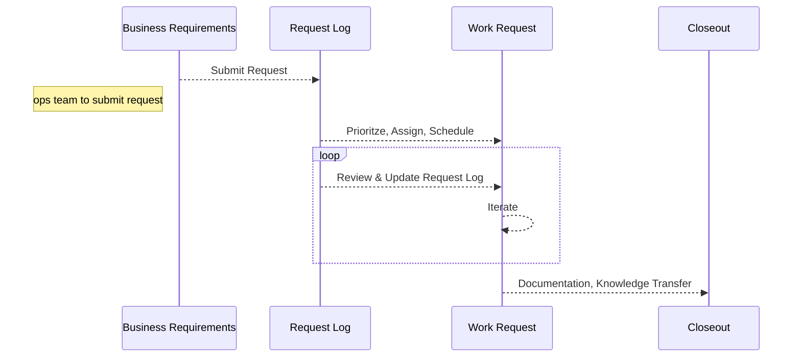
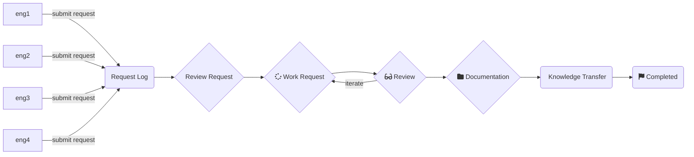

# TEAM INNOVATION
- Michelle Nazath
- Stefan Axelson
- Anthony Farina
- Jonny Le
- Ben Verley
- Alex Barraza

---
# What is DevOps

The DevOps team, aka the coders. We build the tools that the Digital Innovation team dreams up to make life easier, our work more reliable, our data more accurate.

---

---

# PATH TO ORDER
1. Gather Requirements Uniformly
2. Properly Sequence Tasks & Projects
3. Individual Task Management
4. Understand & Articulate Value 
5. Sales Messaging

---

# WORKFLOW

---

---

---

# REQUEST LOG
## REQUEST FORM
- [Request Form Link](https://app.smartsheet.com/b/form/5af35d5dc51f42f5975e4570f7f8e268)

## DASHBOARD
- [Dashboard Link](https://app.smartsheet.com/dashboards/w8pRRQfjGW65354rFpCcj4PxC4h6fVJ65F65Cv41)
-- Active Request Log
-- Completed Request Log
-- Request Summaries

--- 