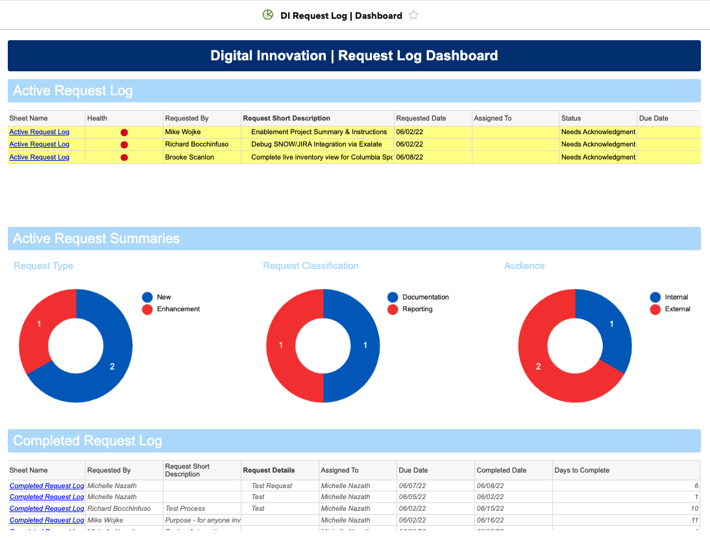
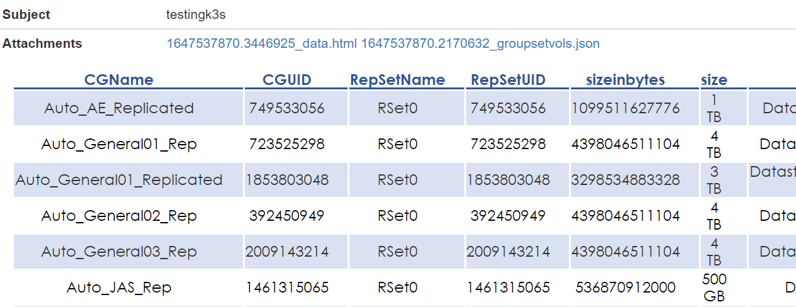
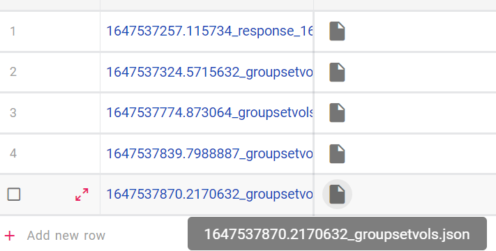

# TEAM INNOVATION
- Michelle Nazath
- Stefan Axelson
- Anthony Farina
- Jonny Le
- Ben Verley
- Alex Barraza

---
# What is DevOps

The DevOps team, aka the coders. We build the tools that the Digital Innovation team dreams up to make life easier, our work more reliable, our data more accurate.

---

---

# PATH TO ORDER
1. Gather Requirements Uniformly
2. Properly Sequence Tasks & Projects
3. Individual Task Management
4. Understand & Articulate Value 
5. Sales Messaging

---

# WORKFLOW

---

---

---

# REQUEST LOG
## REQUEST FORM
- [Request Form Link](https://app.smartsheet.com/b/form/5af35d5dc51f42f5975e4570f7f8e268)

## DASHBOARD
- [Dashboard Link](https://app.smartsheet.com/dashboards/w8pRRQfjGW65354rFpCcj4PxC4h6fVJ65F65Cv41)
-- Active Request Log
-- Completed Request Log
-- Request Summaries

--- 

---

# EMAIL API

## Problem Statement
As part of our services we provide daily reports via email with the current status of all devices we manage. This provides huge value to the customer in that is gives them a summary of the environments health each morning they can review quickly without having to login and check each system manually or sort through individual emails from each device. However maintaining this has been complex, there had to be a better way. Issues with the original deployment were:
- Inconsistency of format, structure and deployment of all email updates
- Dependent on the customer to run said email report
- In ability to manage updates to script across all customers at once

---

# EMAIL API | CREATE REPORT

* Sends an HTML Tabular Report
* Attachments allowed
* Body/descriptions allowed
* All attachments are saved in NocoDB
* All events are logged in a syslog

---
# EMAIL API | CREATE DATABASE (NocoDB)

* Open Source
* Converts a database to spreadsheets
* Saves all attachments
* Located by timestamp

---

<!-- _class: mjn -->

## EMAIL API | SYSLOG

- Leverages loguru for local logging and sysloging
- Various options for logging
    - console
    - file
    - syslog

<!-- Follows the automated workflow, Git to kubernetes pipeline (high level)screenshot of syslog server-->

---

# REFACTOR HEALTH SCRIPT PROJECT
- Email API work led us to health script refactor project
- More universal code base for health reports
- Eliminated the depenecy of hard coded Customer information in individual scripts 
    - Created NocoDB for configuration setting

<!--- The second project I have worked on so far is a refactorization project for the reporting scripts that exist accross most of our customers. All of these scripts had their own form of emailing and this is what the email api was set up for. Refactoring them to consume the email api led to an effort to make a more universal code base that all customers could pull from instead of a variety of highly custom scripts that all accomplish roughly the same task. This effort is still ongoing --->

---

# WHERE WE ARE HEADED
Refactored health scripts will
- consume email api to have universal theme
- exist in a repo that is pulled each time they run at customer sites
- pull all customer info from external sources (Snow, NocoDB, ini)
<!--- The end goal of these projects will tie together many efforts of the whole team. The reporting scripts code base will consume the email api, and be hosted on github where Jonny's deployment autmoation efforts with jenkins and kubernetes will allow for each customer to pull from the latest code base before running scripts ensuring they have the most up to date code. --->