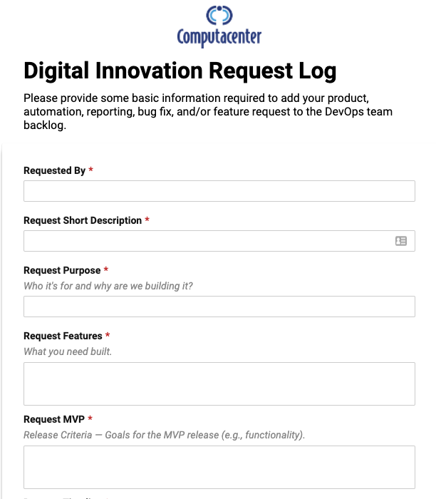
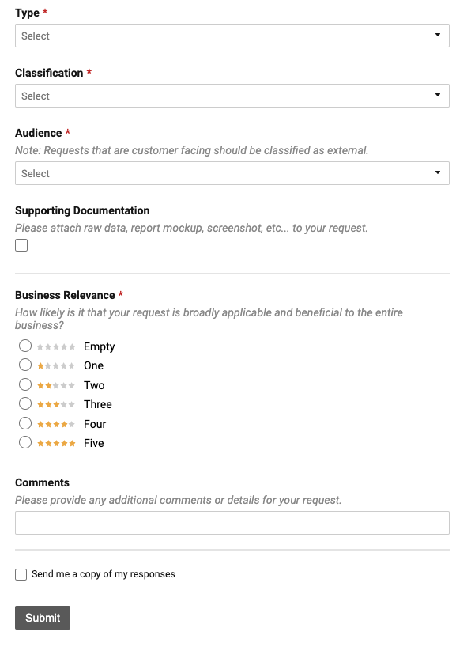
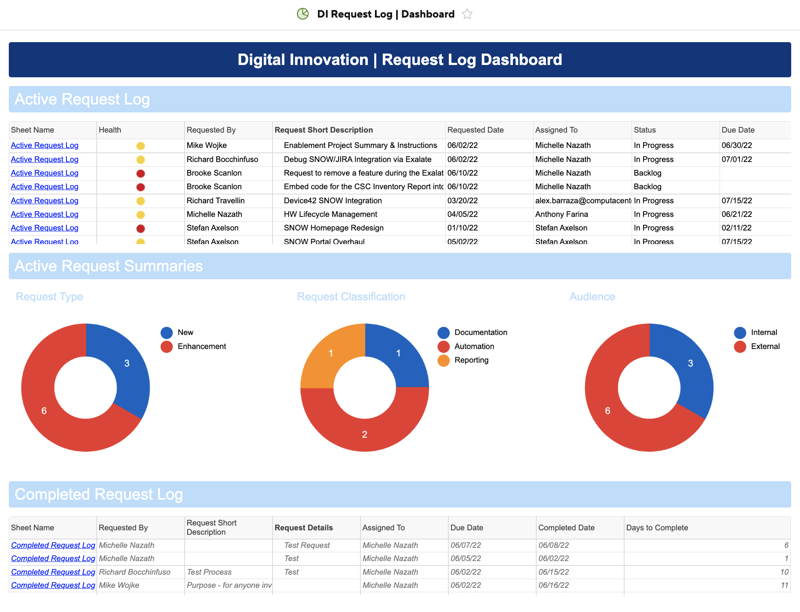
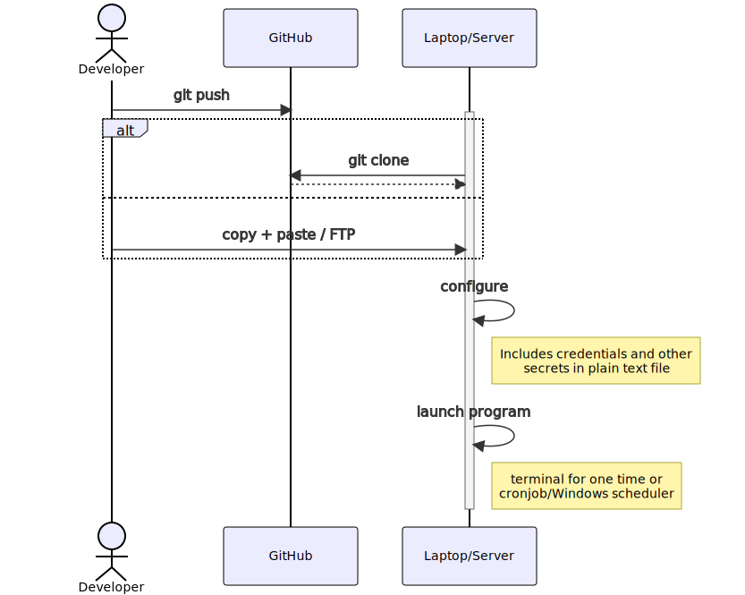
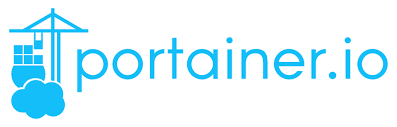
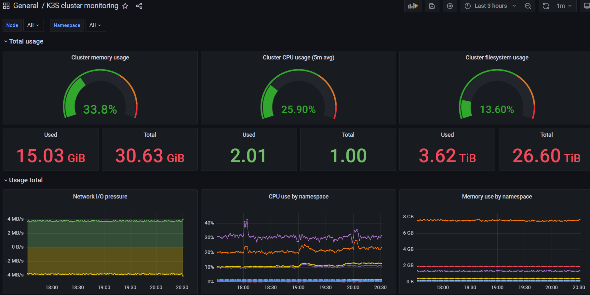
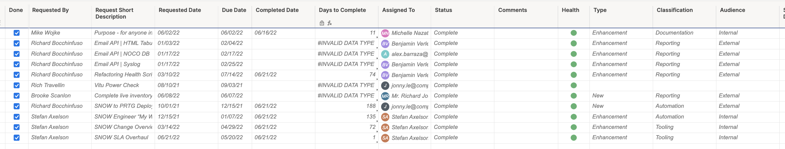
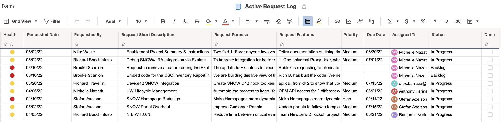

# 
# The NEW Kingmakers

---
# HOW DEVELOPERS CONQUERED THE WORLD
_"Developers are the most important, most-valuable cinstituency in business today., regardless of industry. Technologist newly empowered with tools, hyperconnectedvia specialized collaboration and communication networks, and increasegly aware of their own value are no longer content to be mere stage players. They're taking an active hand at direction. That gene is out of the bottle, and will not be returned to it."_ - Stephen O'Grady, The New Kingmakers

* **DISCLAIMER**  _"However, developers can only represent a competitive edge for a business if they are willing to work with that business"_

---
# WHAT IS DEVOPS WITHIN XS?

The DevOps team, aka the coders. We build the tools that the Digital Innovation team dreams up to make life easier, our work more elegant,reliable, our data more accurate.

---

---

# PATH TO ORDER
1. Gather Requirements Uniformly
2. Properly Sequence Tasks & Projects
3. Individual Task Management
4. Understand & Articulate Value 
5. Sales Messaging

---

# REQUEST LOG WORKFLOW

## I LOVE MERMAID

<!--
graph LR
    A[eng1] -> |submit request| E(Request Log)
    B[eng2] -> |submit request| E(Request Log)
    C[eng3] -> |submit request| E(Request Log)
    D[eng4] -> |submit request| E(Request Log)
    E -> F{Review Request}
    F -> G{fa:fa-spinner Work Request}
    G -> H{fa:fa-glasses Review}
    H ->|iterate|G
    H -> I{fa:fa-folder Documentation}
    I -> J(fa:fa-light Knowledge Transfer)
    J -> K(fa:fa-flag Completed)
-->

---
# WE ARE NOT MIND READERS
 

 

# _SO PLEASE USE OUR REQUEST LOG!_

---

## REQUEST FORM
[Request Form Link](https://app.smartsheet.com/b/form/5af35d5dc51f42f5975e4570f7f8e268)

---

# DASHBOARD
- [Dashboard Link](https://app.smartsheet.com/dashboards/w8pRRQfjGW65354rFpCcj4PxC4h6fVJ65F65Cv41)
-- Active Request Log
-- Completed Request Log
-- Request Summaries

---

# LEGACY DEVOPS WORKFLOW

<!-- Anthony -->

---

<!--
_class: lead
-->

# FRESH START

* What tools to use?
* How about the workflow?

<!--
- devops team was new and what is it
- emphasize number of tools to choose from
- devops is about efficiency and speed
-->

---

<!--
_class: lead
-->

# NEW AUTOMATED WORKFLOW

<!--
- manually, the process is like...
- emphasize single line from dev pov
-->

---

<!-- _class: mjn -->

## TOOL SYNCHRONIZATION

### GOAL
* ServiceNow to become the single source of truth 

### PROJECTS AROUND THIS WHY
1. Automated ServiceNow to PRTG Deployment
2. Map Device 42 to SNOW CMDB automatically 
3. Automated sync script across PRTG > Meraki > SNOW that detects and corrects naming convention errors

---
# SERVICENOW SINGLE SOURCE OF TRUTH

<!-- graph LR
    A(Device42) -.-> C
    G(PRTG)-.-> C
    B(OEM API) -.-> C((SERVICENOW))
    C -.-> D(Automated PRTG Deployment)
    C -.-> E(Warranty Status Dashboards)
    C -.-> F(Customer Reporting)-->

---

# SNOW TO PRTG DEPLOYMENT
## PROBLEM STATMENT
Deployment of PRTG for each customer was very manual and comprehensive process that is completely seperated from SNOW CMDB creation. So we were constantly running into the issue of SNOW and PRTG not matching.

---
# DEVELOPERS WORKFLOW 
## 1. SOLVE PROBLEM LOCALLY
- Break the issue into bite size chunks to work on
- Develop solution
- Test and re-test
- Version control the code

---

## 2. MOVE TO PRODUCTION

## HARDEN APPLICATION
- Create global configurations
- Encrypt PRTG and SNOW credentials
- Create container configuration

## BUILD PROCESS
- Build container image
- Push to container registry
- Deploy to Docker Server

---

# CONTAINERS

---

## 3. PRODUCTION TO SCALE 
## Kubernetes
- Complete control of ingress and egress
- Automatic TLS certificates
- Load balance workload
- Automatic scaling based on cpu/memory consumption
- High-availability across nodes (and regions)

---

# LIVE NOW

#### **Projects**

- Power Outage Monitor
- SNOW to PRTG Automation
- Email API

<!--
- self-deployed apps
-->

---

# COMPLETED | ACTIVE | BACKLOG

---

<!-- engage us we are all just waiting to help you more! -->

