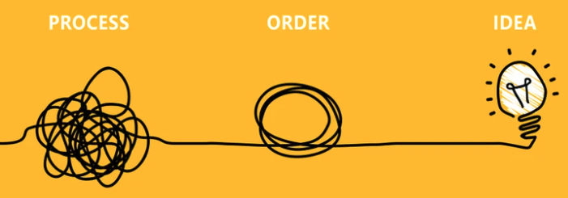
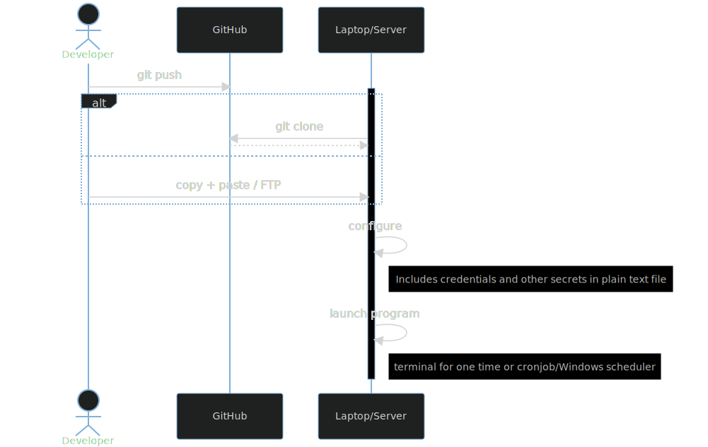
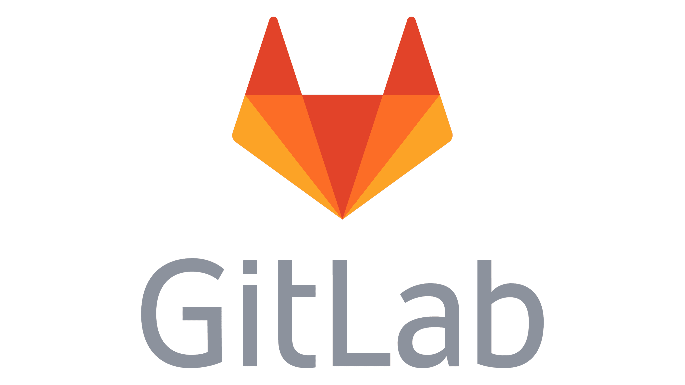
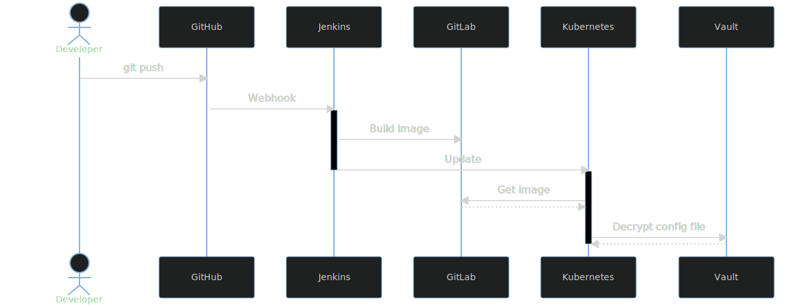

# 
# The NEW Kids on the Block

---
# WHAT IS DEVOPS?

The DevOps team, aka the coders. We build the tools that the Digital Innovation team dreams up to make life easier, our work more elegant,reliable, our data more accurate.

---

---

# PATH TO ORDER
1. Gather Requirements Uniformly
2. Properly Sequence Tasks & Projects
3. Individual Task Management
4. Understand & Articulate Value 
5. Sales Messaging

---

# WORKFLOW

<!--
graph LR
    A[eng1] -> |submit request| E(Request Log)
    B[eng2] -> |submit request| E(Request Log)
    C[eng3] -> |submit request| E(Request Log)
    D[eng4] -> |submit request| E(Request Log)
    E -> F{Review Request}
    F -> G{fa:fa-spinner Work Request}
    G -> H{fa:fa-glasses Review}
    H ->|iterate|G
    H -> I{fa:fa-folder Documentation}
    I -> J(fa:fa-light Knowledge Transfer)
    J -> K(fa:fa-flag Completed)
-->

---
# WE ARE NOT MIND READERS
 

 

# _SO PLEASE USE OUR REQUEST LOG!_

---

## REQUEST FORM
[Request Form Link](https://app.smartsheet.com/b/form/5af35d5dc51f42f5975e4570f7f8e268)

---

# DASHBOARD
- [Dashboard Link](https://app.smartsheet.com/dashboards/w8pRRQfjGW65354rFpCcj4PxC4h6fVJ65F65Cv41)
-- Active Request Log
-- Completed Request Log
-- Request Summaries

---

# COMPLETED | ACTIVE | BACKLOG

---

# LEGACY DEVOPS WORKFLOW

---

<!--
_class: lead
-->

# FRESH START

* What tools to use?
* How about the workflow?

<!--
- devops team was new and what is it
- emphasize number of tools to choose from
- devops is about efficiency and speed
-->

---

<!--
_class: lead
-->

# CONTAINERS

<!--
- what are containers: illustrate with Moby
- more tools = more complexity, right?
-->

---

<!--
_class: lead
-->

# NEW AUTOMATED THE WORKFLOW

<!--
- manually, the process is like...
- emphasize single line from dev pov
-->

---

# LIVE NOW

#### **Docker**

- PRTG Test Drive

#### **Kubernetes**

- Vault
- Jenkins
- Gitlab

- SNOW to PRTG Automation
- Email API

<!--
- self-deployed apps
-->

---

<!-- _class: mjn -->

## TOOL SYNCHRONIZATION

### GOAL
* ServiceNow to become the single source of truth 

### PROJECTS AROUND THIS WHY
1. Automated ServiceNow to PRTG Deployment
2. Map Device 42 to SNOW CMDB automatically 
3. Automated sync script across PRTG > Meraki > SNOW that detects and corrects naming convention errors

---
# SERVICENOW SINGLE SOURCE OF TRUTH

<!-- graph LR
    A(Device42) -.-> C
    G(PRTG)-.-> C
    B(OEM API) -.-> C((SERVICENOW))
    C -.-> D(Automated PRTG Deployment)
    C -.-> E(Warranty Status Dashboards)
    C -.-> F(Customer Reporting)-->

---

# DEVELOPERS WORKFLOW 
## SNOW TO PRTG DEPLOYMENT
### PROBLEM STATMENT
Deployment of PRTG for each customer was very manual and comprehensive process that is completely seperated from SNOW CMDB creation. So we were constantly running into the issue of SNOW and PRTG not matching.

---

# 1. SOLVE PROBLEM LOCALLY
- Break the issue into bite size chunks to work on
- Develop Solution
- TEAM ADD MORE

---

# 2. MOVE TO PRODUCTION

## HARDEN APPLICATION
- Move Credentials to Vault
- No plain text keys or secrets
- No Constants
## BUILD PROCESS
- Containerize 
- ADD MORE

---

# 3. PRODUCTION TO SCALE 
## Kubernetes
- ADD MORE

---

<!-- engage us we are all just waiting to help you more! -->

