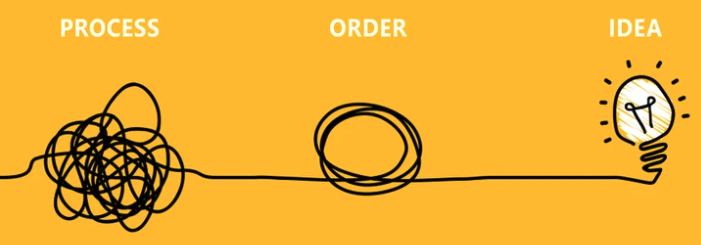
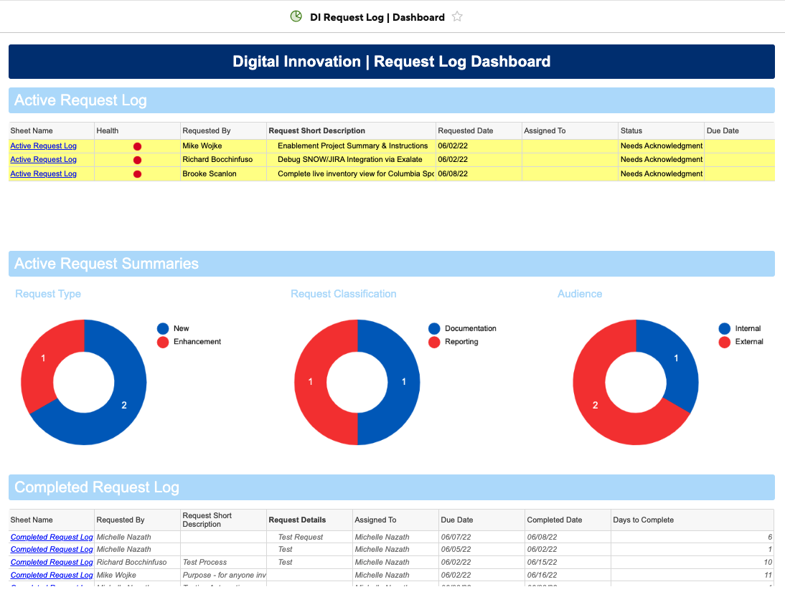
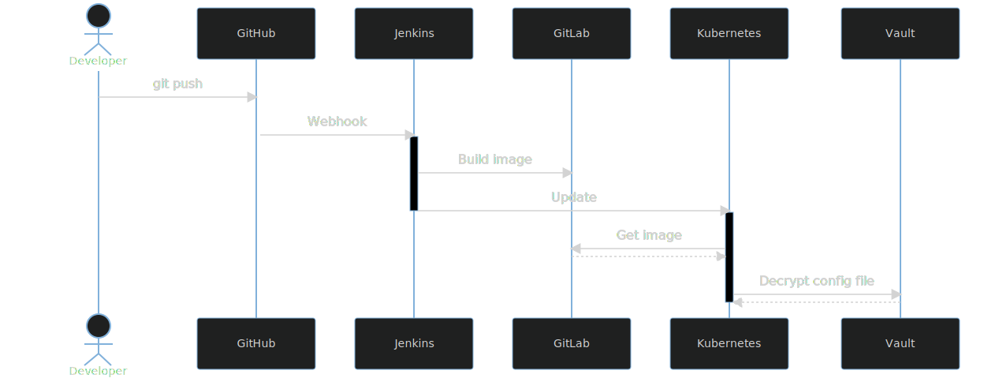
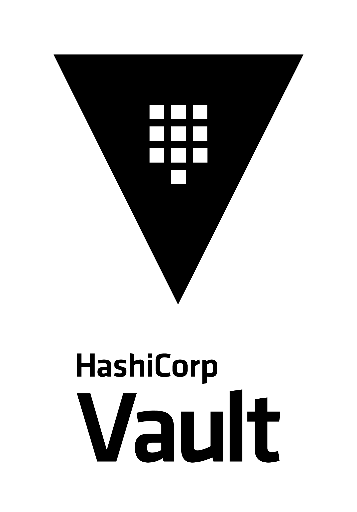
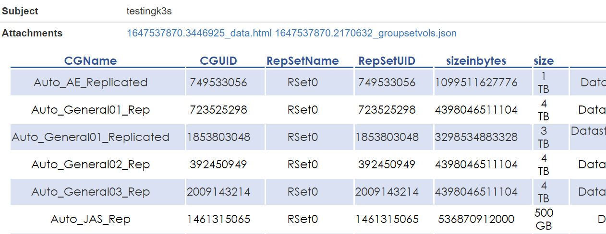
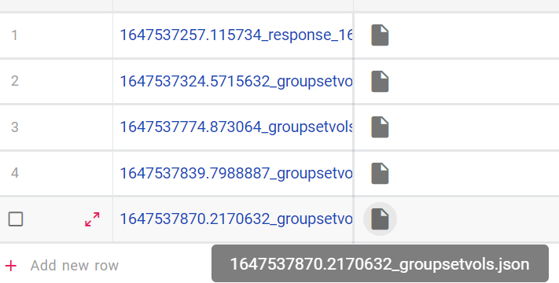
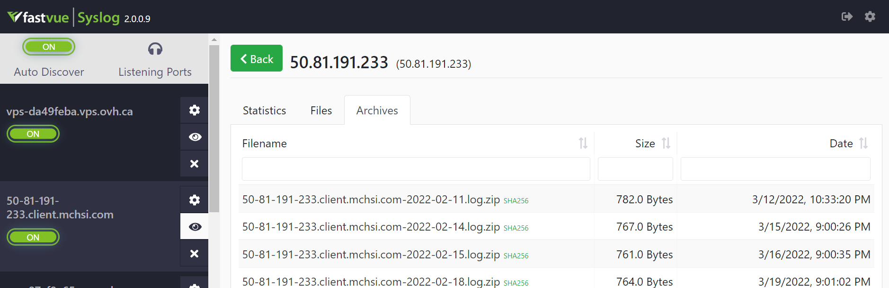
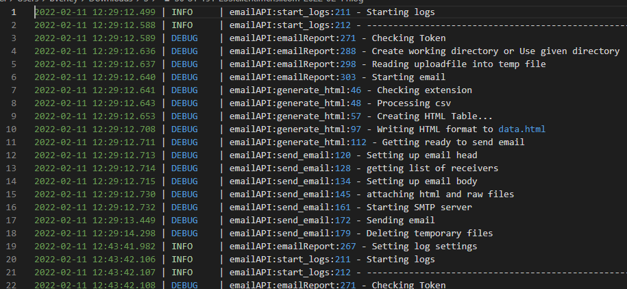

# 
# The NEW Kingmakers

---
# WHAT IS DEVOPS?

The DevOps team, aka the coders. We build the tools that the Digital Innovation team dreams up to make life easier, our work more reliable, our data more accurate.

---

---

# PATH TO ORDER
1. Gather Requirements Uniformly
2. Properly Sequence Tasks & Projects
3. Individual Task Management
4. Understand & Articulate Value 
5. Sales Messaging

---

# WORKFLOW

sequenceDiagram
    participant Business Requirements
    participant Request Log
    participant Work Request
    participant Closeout
    Business Requirements-->>Request Log: Submit Request
    Note left of Business Requirements: ops team to submit request 
    Request Log-->>Work Request: Prioritze, Assign, Schedule
    loop 
        Request Log-->>Work Request: Review & Update Request Log
        Work Request-->>Work Request: Iterate
    end
    Work Request-->>Closeout: Documentation, Knowledge Transfer

---

graph LR
    A[eng1] --> |submit request| E(Request Log)
    B[eng2] --> |submit request| E(Request Log)
    C[eng3] --> |submit request| E(Request Log)
    D[eng4] --> |submit request| E(Request Log)
    E --> F{Review Request}
    F --> G{fa:fa-spinner Work Request}
    G --> H{fa:fa-glasses Review}
    H -->|iterate|G
    H --> I{fa:fa-folder Documentation}
    I --> J(fa:fa-light Knowledge Transfer)
    J --> K(fa:fa-flag Completed)

---

---

# REQUEST LOG
## REQUEST FORM
- [Request Form Link](https://app.smartsheet.com/b/form/5af35d5dc51f42f5975e4570f7f8e268)

## DASHBOARD
- [Dashboard Link](https://app.smartsheet.com/dashboards/w8pRRQfjGW65354rFpCcj4PxC4h6fVJ65F65Cv41)
-- Active Request Log
-- Completed Request Log
-- Request Summaries

---

<!--
_class: lead
-->

# FRESH START

* What tools to use?
* How about the workflow?

<!--
- devops team was new and what is it
- emphasize number of tools to choose from
- devops is about efficiency and speed
-->

---

<!--
_class: lead
-->

# CONTAINERS

<!--
- what are containers: illustrate with Moby
- more tools = more complexity, right?
-->

---

<!--
_class: lead
-->

# AUTOMATE THE WORKFLOW

<!--
- manually, the process is like...
- emphasize single line from dev pov
-->

---

# LIVE NOW

#### **Docker**

- PRTG Test Drive

#### **Kubernetes**

- Vault
- Jenkins
- Gitlab

- SNOW to PRTG Automation
- Email API

<!--
- self-deployed apps
-->

---
<!-- _class: table-->
# PROJECT LIST ACTIVE | COMPLETED | BACKLOG

| Active | Completed | Backlog | 
| :----------- | :----------- | :----------- |
| Email API | Power Check | |
| Refactoring of Health Scripts | SNOW to PRTG Deployment Automation| | |
| Device42 to SNOW CMDB Automation & Validation | | |
| PRTG Sensor Cleanup | | | 
| SNOW>Meraki>PRTG Validation| | | 
| SNOW Enduser Improvements | | |
| N.E.W.T.O.N. | | | 

---

# EMAIL API

## Problem Statement
As part of our services we provide daily reports via email with the current status of all devices we manage. This provides huge value to the customer in that is gives them a summary of the environments health each morning they can review quickly without having to login and check each system manually or sort through individual emails from each device. However maintaining this has been complex, there had to be a better way. Issues with the original deployment were:
- Inconsistency of format, structure and deployment of all email updates
- Dependent on the customer to run said email report
- In ability to manage updates to script across all customers at once

---

# DEVELOPERS WORKFLOW

---

---

# EMAIL API | CREATE REPORT

* Sends an HTML Tabular Report
* Attachments allowed
* Body/descriptions allowed
* All attachments are saved in NocoDB
* All events are logged in a syslog

---
# EMAIL API | CREATE DATABASE (NocoDB)

* Open Source
* Converts a database to spreadsheets
* Saves all attachments
* Located by timestamp

---

<!-- _class: mjn -->

## EMAIL API | SYSLOG

- Leverages loguru for local logging and sysloging
- Various options for logging
    - console
    - file
    - syslog

<!-- Follows the automated workflow, Git to kubernetes pipeline (high level)screenshot of syslog server-->

---

# REFACTOR HEALTH SCRIPT PROJECT
- Email API work led us to health script refactor project
- More universal code base for health reports
- Eliminated the depenecy of hard coded Customer information in individual scripts 
    - Created NocoDB for configuration setting

<!--- The second project I have worked on so far is a refactorization project for the reporting scripts that exist accross most of our customers. All of these scripts had their own form of emailing and this is what the email api was set up for. Refactoring them to consume the email api led to an effort to make a more universal code base that all customers could pull from instead of a variety of highly custom scripts that all accomplish roughly the same task. This effort is still ongoing --->

---

# WHERE WE ARE HEADED
Refactored health scripts will
- consume email api to have universal theme
- exist in a repo that is pulled each time they run at customer sites
- pull all customer info from external sources (Snow, NocoDB, ini)
<!--- The end goal of these projects will tie together many efforts of the whole team. The reporting scripts code base will consume the email api, and be hosted on github where Jonny's deployment autmoation efforts with jenkins and kubernetes will allow for each customer to pull from the latest code base before running scripts ensuring they have the most up to date code. --->

---
<!-- _class: mjn -->

## TOOL SYNCHRONIZATION

### WHY
* D42 does not allow ServiceNow to add more than one device at this time

### MVP FEATURES
* Created an API to pull all data from D42 to a csv
* Map data in csv to ServiceNow to populate CMDB instantly

### REV 2
* Improve internal workflow on Device42

---
<!-- _class: mjn -->

## TOOL SYNCHRONIZATION

### MVP 
- Automated sync script across PRTG > Meraki > SNOW that detects and corrects naming convention errors
- Workflow
    - Gathers information about a device from PRTG & Meraki 
    - Validates ServiceNow records match customer environments

### Rev 2 | Change Control
 - Automate ticket creation before device names are changed
 - Require Customer Approval
 - Execute cross-environmental changes
### Rev 3 | Generalization
- Expand to other customers
- Expand to other vendors

---

# PRTG SENSOR CLEANUP
- 70,000 sensors
- Automated the deletion of 10s of thousands of sensors to make the PRTG monitoring system more responsive
- Used the PRTG API to detect and delete only specific sensors in the network

 <!-- First exposure to using an API and working with an enterprise network monitoring tool-->

---

# SNOW PROJECTS
- Engineer "My Work Page" Redesign
- Homepage Redesign
- Change Overview Board
- Customer Service Board
- SLA Overhaul
- Portal Overhaul

---

SNOW CONTINUED - pending photos from stefan

---

SNOW CONTINUED - pending photos from stefan

---

# THE END

---

ABOUT ME NOTES

<!---
BEN
# When I started
- Refresher on Python, learned FastAPI
- Worked on Email API interactions
- Consumption of Email API

 When I started the first project I was put on was working on the email API with Alex. I had to do a quick refresh of python, and learn about fast api, which is the restful api platform we were building our api with. I mostly worked on working out a few kinks, and how the api would be consumed. This led me into the second project I have worked on which was refactoring existing reporting scripts to consume the api --->

 <!-- 
 ANTHONY
 # When I started / What I do
 - I started at the beginning of February last year
 - I specialize in automation
 - I typically work with the PRTG, Meraki, and pysnow APIs to create scripts that will help customers or the team-->

 <!--
 STEFAN
 - Joined Onboarding in 2020
- Became Snow Admin after Lisa left in 2021
- Moved to Dev Ops in 2022-->